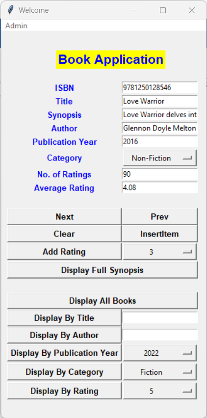

# Book_Rating

1. Run the AppGUI.py by entering 
``` 
python AppGUI.py
```

2. You will now be able to 
    - enter details of the book
    - view the full synopsis of the book
    - view all the books from the database
    - view the book by searching the title, author, publication year, category and rating
    - add rating

3. Sample Output 


